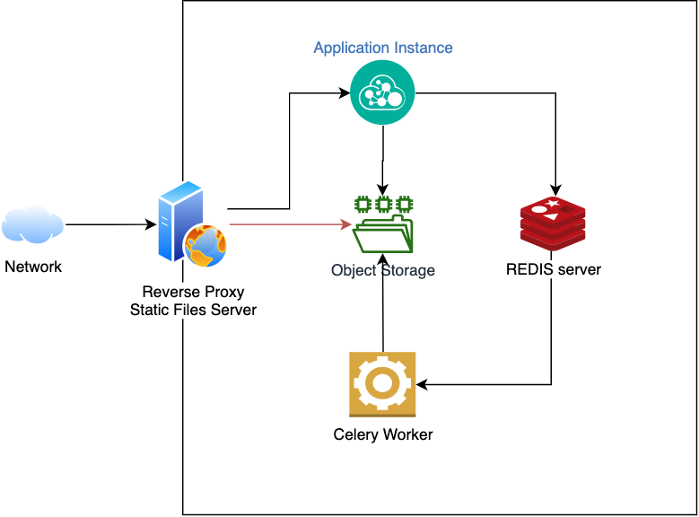

# Assignment 2 - Code

## Premisses and assumptions

The code is based on the provided documentation:

[Assignment](docs/Assignment Cloud Software Engineer and Devops 20210805.pdf)

The goal of this API is to provide a flexible image processing tools, based on the requirements described in this document.

I took for granted some assumptions based in the instructions:

```Any combination of the above operations```

My assumption at this point is that the user may specify not only the combination, but the order of the parameters and processing. *The image processing is considered to be a pipeline where every step uses as input the output of the last step*, in the order the user provided. 

```Resizing the image to any reasonable size smaller than the origin image.```

Also considered that the user may be free to resize the image as he likes. I could assume the resizing to be done in many different ways (percentual, fixed propotion by axis, totally flexible) but it was easy to make the API plain flexible and allow resizing anyway the user want.
Also, as this processing is a pipeline, if the resizing comes after a file spliting, the splitted images shall be resized to the target size provided by the user.

```All images can be assumed to be present as local files on the same machine where the service runs or any location which makes your life easier.```

The service implementation allows the user to call the HTTP interfacing and, in the same request, send the image for processing as multipart. As this makes my life easier (and maybe the user`s too), I have designed this way.
Changing this to point to a location in the disk is also fairly simple in this API design. An usage example is also included in this repository.

```You can assume that there will be only 1 request at the same time although more request may come in while the processing is still running.```

```You do not have to take into account the issue of dependencies between requests.```

The service may take concurrent calls, as the Celery worker may receive paralel requests and will process them as it appears. But, in fact, the application simplify the file tracking and concurrent calls with same file names may incur in some sort of race condition. As this tip allows me not to worry with that, I`ll use in my favor.

```You can assume the height and width of all input images are 512x512 + 1024x1024 or any size limitation which is convenient for you, expect that the code should be able to support at least two different sizes.```

The API accepts arbitrary image, no need to constrain this. I guess this fills this requirement and makes a flexible API more... flexible :)

```You could use flask as a web framework for you```

```You could use opencv to process images```

Chose aiohttp over Flask because is... plain fun. Not very different, same approach for interfaces and application entrypoint/blueprints.

```You’re free to use any open-source distributed processing framework include one as simple “make”```

I chose Celery+Redis to fulfill this requirement.


## Installation

### Linux/OSX 

Dependencies: 
 - make
 - Docker: [Get Docker](https://docs.docker.com/get-docker/)
 - Docker Compose
```
pip install docker-compose
```

Clonning and Running: 
```
git clone https://github.com/SamambaMan/imageprocessing.git
cd imageprocessing
make run
```

Testing:
```
make test
```

Development Console:
```
make devconsole
```

Debugging
While the application is running, developer may want to debug using python pdb or similar. If so, run another terminal instance and:

Web Container:
```
docker attach $(docker ps | grep imageprocessing_web | cut -f 1 -d ' ')
```

Worker Container:
```
docker attach $(docker ps | grep imageprocessing_web | cut -f 1 -d ' ')
```


### Application architecture


The application uses a simple architecture, segregating internet networking from the application infrastructure through NGINX.

The web server provides a reverse proxy for the application instance and also works as a simple HTTP file server so the user may download the files from the storage instance.

### Service Interface

```
localhost:8080/process - method: POST
```

The api accepts a multipart/form-data post with two *array fields*:
 - actions - array of JSON process parameters
 - files - array of JPG images


After image processing, the user may check sent and processed images in:

```
http://localhost:8080/static/
```

### Actions JSON template

```
{
    "resize":"200x300",
    "split":true,
    "blur":"gaussian|updownsampling|bilateral|median",
    "output":"jpg|png"
}
```

The user may specify the parameters in any order, as the API will process them in that specified order.